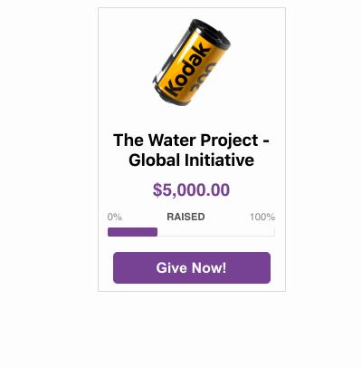
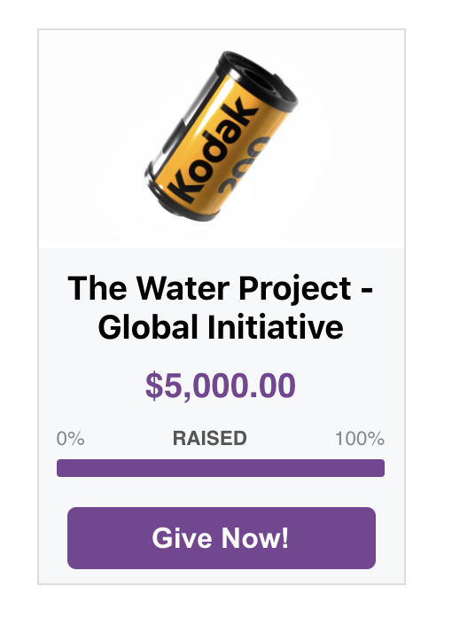

# WidgetMaker

This WidgetMaker application is a reusable react widget that displays, updates, and allow users to donate. The WidgetMaker component may be reused multiples times in an application.

## Screenshots

Behavior:



Home screen:



## Installation

Yarn is the package manager. It will install and manage the dependencies.

- ### `yarn install`

  to install the required dependencies

- ### `yarn start`

  to run the application locally in development mode.

  - Open `http://localhost:3000` to view the application in the browser

## How to Use

import the `Widget` component and add the following props:

- organization
- logo
- themeColor (if none provided, a default theme color will be applied)
- themeContrast (if none provided, a default theme contrast color will be applied)

See `./src/App.jsx`

```
      <Widget
        organization={YOURORGANIZATIONNAME}
        logo={YOURIMAGEHERE}
        themeColor={YOURTHEMECOLOR}
        themeContrast={YOURTHEMECONTRASTCOLOR}
      />
```

## Data

Mock data is stored in `./src/components/Utils/Data.js`

The `campaignData` object stores the 'Campaign' data for two mock organizations.

The two default 'mock' organizations are: `waterProject` and `foodDriveOrlando`

## Testing

### Unit Tests

Unit tests are located in the `src` folder inside the components folders in files named like `*.test.js`. (Look in folders: `Tiles` and `ProgressBar`)

- `yarn test` : single run of the unit tests
- `yarn test:coverage`: run test coverage

## Features

- Widget is reusable
- Logo sizes may vary
- Custom themes are allowed for each widget
- Progress bar updates in realtime
- Mock API calls to GET and UPDATE the widget data
- Users can interact by adding donation amounts
- Default `Tiles` allow users to quickly add a donation with one tap
- Confirmation page after user sends a donation
- CSS modules/SASS used for styling
